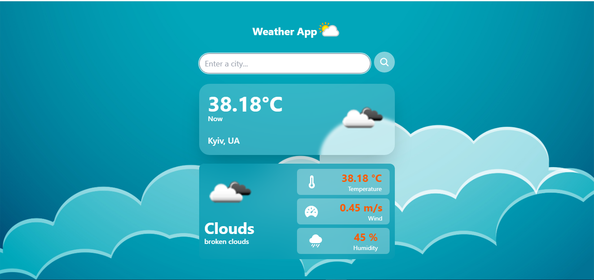

# Weather App

This is a simple, beautiful weather application built with Django. Users can enter a city name to get the current weather information. The application features a responsive design, ensuring a seamless experience across various devices.



## Features

- Fetches current weather data for any city.
- Displays temperature, wind speed, humidity, and weather description.
- Responsive design with a visually appealing interface.

## Technologies Used

- Django: Web framework for building the application.
- Tailwind CSS: Utility-first CSS framework for styling.
- OpenWeatherMap API: For fetching weather data.

## Installation

1. **Clone the repository:**

    ```bash
   git clone https://github.com/shevchenkkko/WeatherApp.git
    ```

2. **Create and activate a virtual environment:**

    ```bash
    python3 -m venv venv  # On Windows, use `python -m venv venv`
    source venv/bin/activate  # On Windows, use `venv\Scripts\activate`
    ```
3. **Install the dependencies:**
   ```bash
   pip install -r requirements.txt
    ```
4. **Set up your environment variables:**
    Create a `.env` file in the root directory of your project and add your OpenWeatherMap API key:
    ```env 
    API_KEY=your_openweathermap_api_key
    ```
5. **Run database migrations:**
   ```bash 
   python manage.py migrate
   ```
6. **Start the development server:**
   ```bash
   python manage.py runserver
    ```

## Usage 
* Enter a city name in the input field and click the search icon.
* The current weather information for the entered city will be displayed, including temperature, wind speed, humidity, and weather description.

## License 
This project is licensed under the MIT License.

## Contact 
For more projects, visit my [GitHub](https://github.com/shevchenkkko).